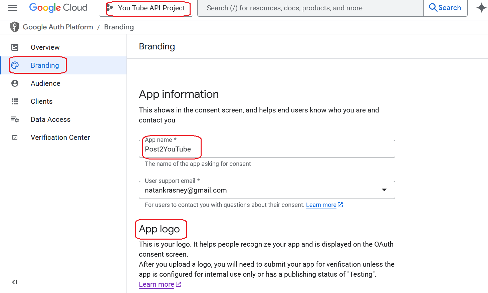
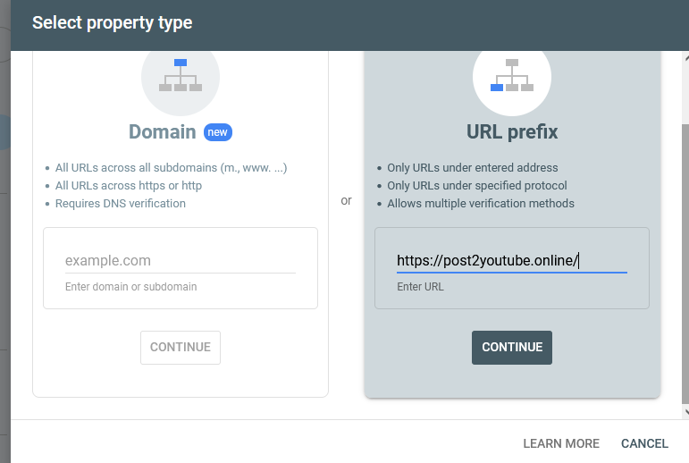
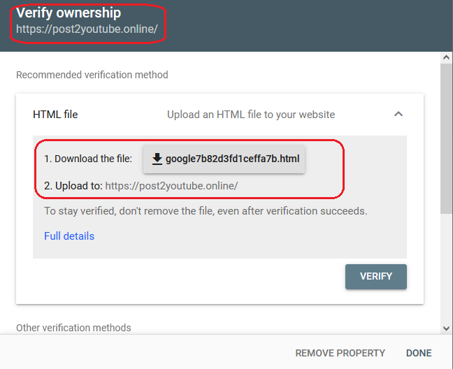
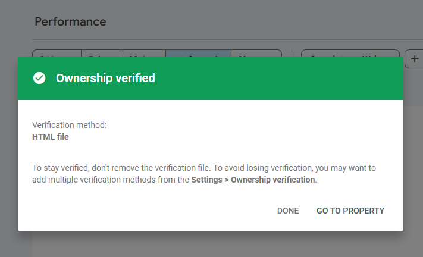

<h1>Project Name</h1>
My Experience with Google OAuth App Verification

<h2>Project Description</h2>
This project documents my experience with the Google OAuth App Verification process for www.post2youtube.com

  <h2>What is Google OAuth App Verification?</h2>

  
Google OAuth App Verification is a process Google officially requires for third-party applications that use Google's OAuth 2.0 authorization system to access Google user data. The primary goals are to ensure the <strong>safety and trustworthiness</strong> of these applications and to protect users and their data.

  
During verification, Google reviews the application's:

  <ul>
    <li><strong>Identity and Branding:</strong> Ensuring accurate representation of the application.</li>
    <li><strong>Requested Scopes:</strong> Verifying the necessity and explanation of requested permissions.</li>
    <li><strong>Privacy Policy:</strong> Confirming a clear and comprehensive data usage disclosure.</li>
    <li><strong>Website and Domain Ownership:</strong> Validating the legitimacy of the associated website.</li>
    <li><strong>Demonstration of Functionality:</strong> If sensitive scopes are requested, 
    Google requires a video demonstrating their use for review.</li>
  </ul>

  
The benefits of verification include increased user trust, reduced risk of malicious apps, enhanced transparency, and removal of the "Unverified app" warning screen.

  <h2>When is Google OAuth App Verification Required?</h2>

  
Google OAuth App Verification is typically required in the following situations:

  <ul>
    <li>
      <h3>Accessing Sensitive or Restricted Scopes</h3>
      
If your application requests access to Google API scopes categorized as <strong>sensitive</strong> (e.g., email, calendar, contacts) or <strong>restricted</strong> (granting broad data access e.g. upload video to youtube), verification is <strong>mandatory</strong>. The Google Cloud Console indicates the scope category.

    </li>
    <li>
      <h3>Displaying Brand Information for External Users</h3>
      
For applications with the <strong>User Type</strong> set to <strong>"External"</strong> that want to show their <strong>app name and logo</strong> on the OAuth consent screen, at least <strong>brand verification</strong> is needed.

    </li>
    <li>
      <h3>External User Type and Production Status</h3>
      
Apps set to <strong>"External"</strong> with a <strong>"In Production"</strong> publishing status generally require verification, especially when using scopes beyond basic profile information.

    </li>
    <li>
      <h3>Changes to Previously Verified Apps</h3>
      
Significant changes to a verified app, such as requesting new sensitive scopes or major branding updates, may necessitate <strong>re-verification</strong>.

    </li>
  </ul>

  <h2>When is Google OAuth App Verification NOT Typically Required?</h2>

  
Verification is often not required in these scenarios:

  <ul>
    <li>
      <h3>Personal Use Apps</h3>
      
Apps for your personal use or a small number of users (under 100) might not initially need verification. However, scaling beyond this limit will require it, and users will see an "Unverified app" screen.

    </li>
    <li>
      <h3>Development/Testing/Staging Apps</h3>
      
Apps in the <strong>"Testing"</strong> publishing status are generally exempt from verification. Keep development and production projects separate. These apps may have a 100-user cap.

    </li>
    <li>
      <h3>Internal Use Apps</h3>
      
Apps used solely within your <strong>Google Workspace or Cloud Identity organization</strong>, configured for <strong>internal use</strong>, usually don't need verification. The project must be owned by the organization.

    </li>
    <li>
      <h3>Service-owned Data Only</h3>
      
Apps that only access their own data using a <strong>Service Account</strong> and don't access user data do not require verification.

    </li>
  </ul>

  
<strong>Important:</strong> Regardless of verification status, all apps integrating with Google APIs must adhere to the <a href="https://developers.google.com/terms/api-services-user-data-policy">Google API Services User Data Policy</a>.

  
Always consult the <strong>Google Cloud Console's OAuth consent screen settings</strong> for your specific project to determine the exact verification requirements.

<h2>Motivation for Me</h2>
I needed verification for Post2YouTube to provide a smoother user experience, remove the "Unverified app" warning, and potentially access higher quota limit
In my case, I want to support more than 100 users, which disqualifies it from being considered a "Personal Use App"

<h2>Important Verification Steps</h2>
The verification process requires inputs that you configure in your Google Cloud project. Some of these are set in the Branding tab, as shown in the image

<h3>Step 1 : Branding</h3>
The app logo requirements appear in this image

 To quickly create a professional logo, I used ChatGPT's image generation capabilities.

<h3>Step 2 : Privacy Policy</h3>

The Google Cloud Console requires a privacy policy, as seen here:

To create this, I provided the content from my app's landing page (<a href='https://www.post2youtube.com'>my app landing page</a>) to Gemini and used a Q&A session to develop the necessary text.

My landing page is shown here: <a href='./figs/post2youtube.com.png'>landing page</a>, and the resulting privacy policy I implemented is visible in this screenshot: <a href='./figs/post2youtube-privacy-policy.com.png'>privacy-policy</a>.

<h3>Step 3 : Verifiy Domain Ownership</h3>
<a href='https://support.google.com/webmasters/answer/9008080?sjid=6673206062964333071-EU'>This is the official docs</a></li>

You can choose any option out of 7 as shown in this image

<h4>post2youtube.com - option 7 'Domain name provider'</h4>

Google Cloud Console side 

domain provider side (Nameschaep) 

back to google clicked verify after few minutes 

<h4>post2youtube.online - option 1 'HTML file upload' </h4>
I couldn't use Option 7 here because I was unable to add a DNS record in Namecheap, so I chose Option 1 instead

Select property type as shown in in the following image

Download the file as show in the following image

 Place the file in your app’s public folder and click the "Verify" button.
The verification appears in the following image

<h3>Step 4 : Create a Video</h3>
scroll down <a href='https://support.google.com/cloud/answer/13464321?hl=en&ref_topic=13460882&sjid=2157921980951485823-EU#'>here</a> or refer to the image below 

<h2>Points of Interest</h2>
<ul>
<li>Why do I see "Verification not required" ?  : This status likely appears because your application is currently in the "Testing" publishing status in the Google Cloud Console. It will likely change to require verification once you switch to the "In Production" status.</li>
</ul>

<h2>References</h2>
<ul>
    <li><a href='https://support.google.com/cloud/answer/13463073?hl=en'>official docs</a></li>
    <li><a href='https://support.google.com/cloud/answer/13464321?hl=en&ref_topic=13460882&sjid=7676787867668491552-EU'>verification requirement</a></li>
</ul>
