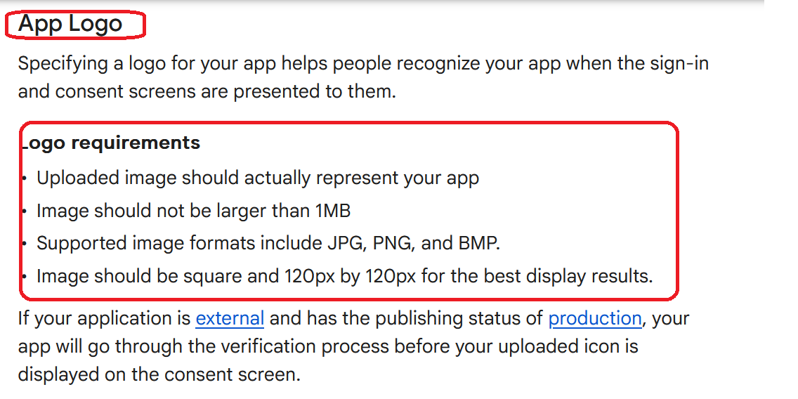
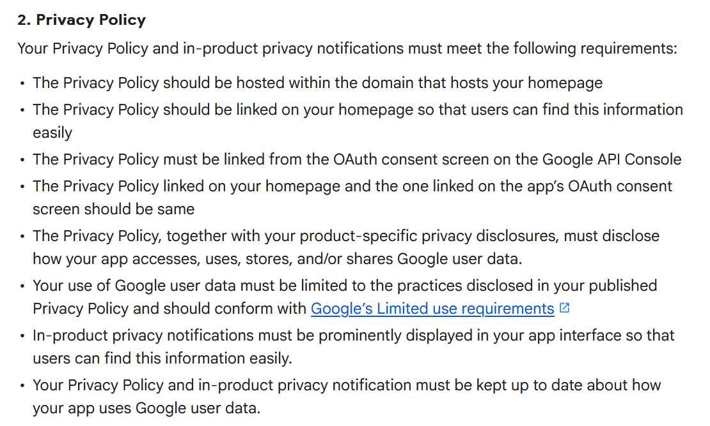
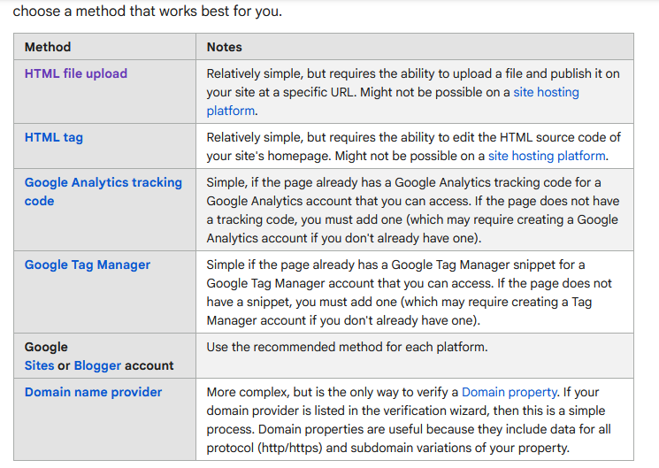
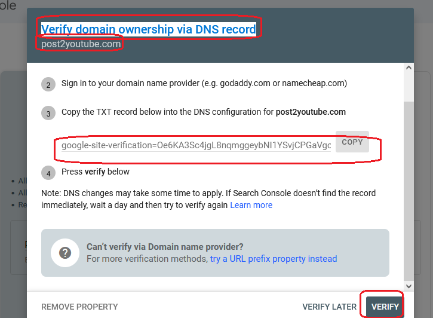
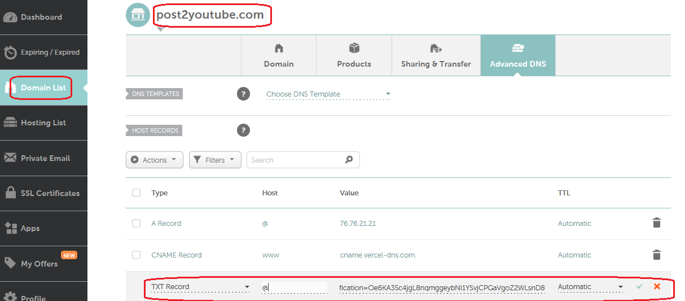
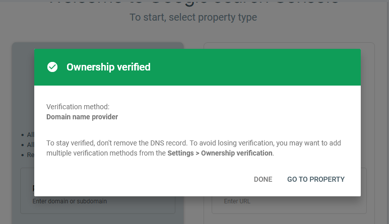
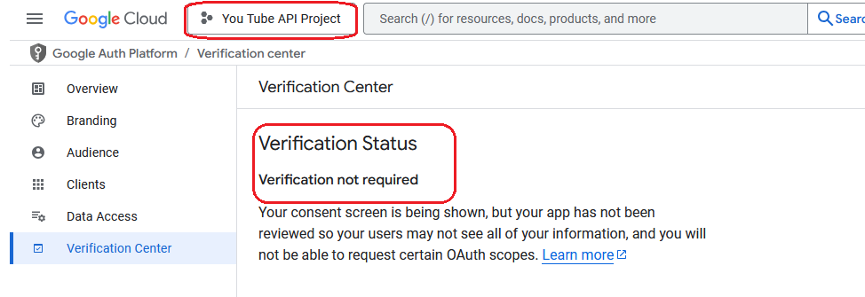

<h1>Project Name</h1>
....

<h2>Project Description</h2>
....

<h2>Motivation</h2>
required for post2output for better UI expereince and more quota chance

<h2>Design</h2>
Questions

<h3>When verification is required</h3>
check <a href='https://support.google.com/cloud/answer/13464323/?sjid=10071116415336674414-EU#exemptions'>here</a>

In my case i want more than 100 users so it violate 'Personal Use apps'

<h2>verification process</h2>

<h3>branding</h3>
the app logo requirements are shown in this image
my logo is <a href='https://github.com/NathanKr/post2youtube-website-private/blob/main/public/images/post2youtube_logo_120x120.png'>here</a>

The app logo requirements appear in this image

I have used chatgpt to create the logo

<h3>privecy policy</h3>

The privacy policy appears here

But what i did was to provide gemini <a href='https://www.post2youtube.com'>my app landing page</a> and ask him what to do using Q & A session.

check 

and the target appears in <a href='https://www.post2youtube.com/privacy-policy'>my app privacy-policy</a>

<h3>verifiy domain ownership</h3>
<a href='https://support.google.com/webmasters/answer/9008080?sjid=6673206062964333071-EU'>here</a></li>

You can choose any option out of 7 as shown in this image 

<h4>post2youtube.com</h4>

google cloud console side 

domain provider side (nameschaep) 

back to google clicked verify after few minutes 

<h4>post2youtube.online</h4>
I was not able to do this using namecheap because i was not able to add record

<h2>Open issues</h2>
<ul>
    <li>why i get verification not needed ? </li>
    <li>logo size</li>
   
</ul>

<h2>todo</h2>
<ul>
    <li>verifiy domain ownership </li>
    <li>Sensitive and Restricted Scope Requirements - <a href='https://support.google.com/cloud/answer/13464321?hl=en'>here scroll down</a></li>
    <li>create a video </li>
</ul>

<h2>Points of Interest</h2>
<ul>
    <li>...</li>
   
</ul>

<h2>References</h2>
<ul>
    <li><a href='https://support.google.com/cloud/answer/13463073?hl=en'>official docs</a></li>
    <li><a href='https://support.google.com/cloud/answer/13464321?hl=en&ref_topic=13460882&sjid=7676787867668491552-EU'>verification requirement</a></li>
</ul>
